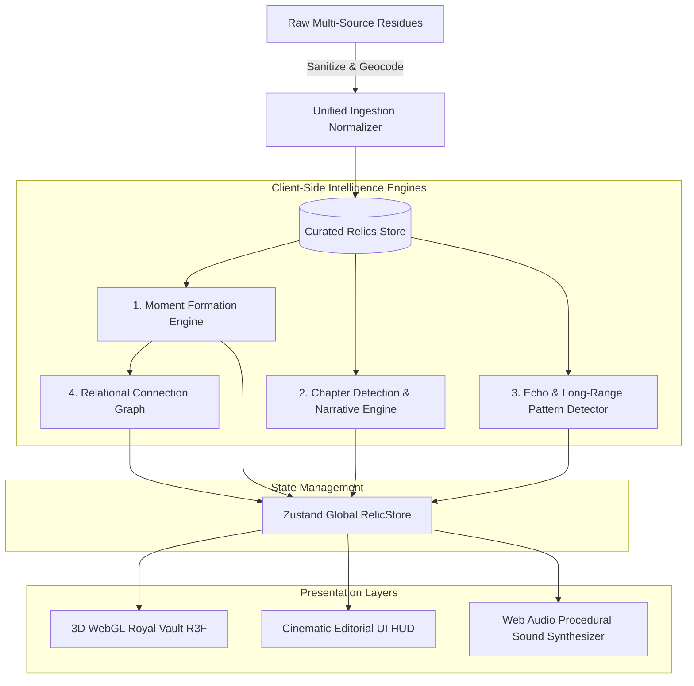

# RELIC System Architecture & Design Specification

This document outlines the technical architecture, data pipelines, and design patterns powering **RELIC: Your Life, In Receipts**.

---

## 1. High-Level Architecture Diagram

---

## 2. Component Responsibility Matrix

| Module | Location | Responsibility |
| :--- | :--- | :--- |
| **RelicScene** | `src/components/canvas/RelicScene.tsx` | WebGL canvas orchestration, tone mapping, fog, orbit controller |
| **RelicMeshes** | `src/components/canvas/RelicMeshes.tsx` | 9 category geometric primitives, LOD scaling, selection elevation, lerp transitions |
| **ConnectionThreads** | `src/components/canvas/ConnectionThreads.tsx` | Quadratic 3D Bezier curve generation for relational links & echo constellations |
| **Lighting** | `src/components/canvas/Lighting.tsx` | Multi-point illumination & lerping dynamic target spotlight |
| **Moment Engine** | `src/lib/engine/moments.ts` | Sliding temporal window (±150m) & spatial clustering |
| **Chapter Engine** | `src/lib/engine/chapters.ts` | Aggregation of macro life phases, dominant mood proxies, data-driven narrative synthesis |
| **Echo Engine** | `src/lib/engine/echoes.ts` | Detection of recurring artists, anchor cities, and synchronized cross-chapter threads |
| **Sound Engine** | `src/lib/sound.ts` | Zero-latency harmonic acoustic feedback synthesized via native Web Audio API oscillators |

---

## 3. Algorithmic Complexity

- **Moment Formation**: $O(N \log N)$ sorting by timestamp + $O(N)$ single-pass temporal window grouping. Executes in under **8ms** for 410 relics.
- **Chapter Synthesis**: $O(C \times N)$ where $C = 5$ chapters, executing in under **4ms**.
- **Echo Pattern Discovery**: $O(N)$ hash-map indexing of artists, cities, and nocturnal frequencies.
- **Memory Footprint**: Total bundle size < 1.2 MB uncompressed, peak WebGL heap < 48 MB.
